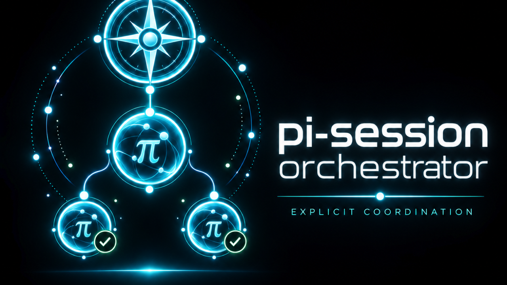
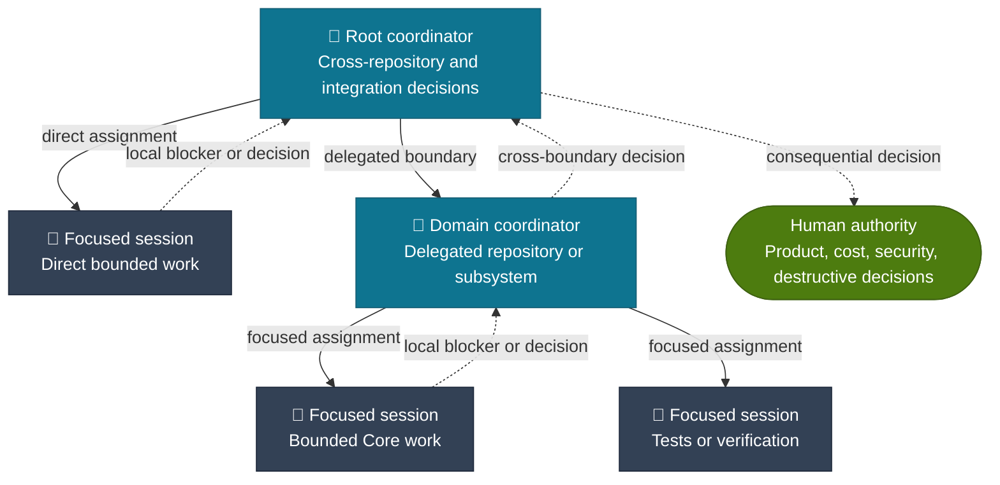
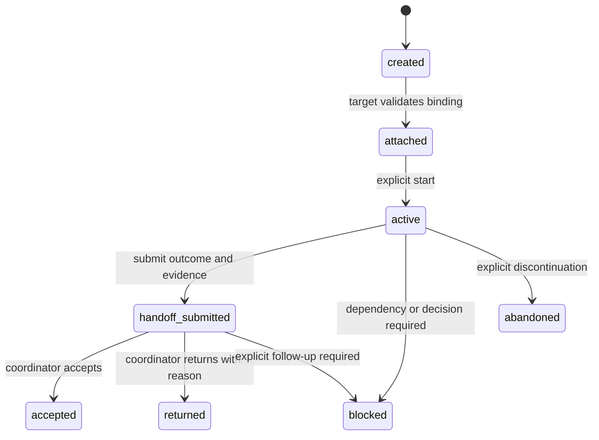

<p align="center">
  
  
  
</p>

<p align="center">
  
</p>

<h1 align="center">Pi Session Orchestrator</h1>

<p align="center">
  Durable, explicit coordination for independently running Pi sessions.<br />
  Keep focused work focused while preserving ownership, context boundaries, and human authority.
</p>

<p align="center">
  <a href="#why">Why</a> ·
  <a href="#coordination-model">Coordination model</a> ·
  <a href="#use">Use</a> ·
  <a href="#safety-boundaries">Safety</a> ·
  <a href="docs/README.md">Documentation</a> ·
  <a href="https://github.com/davidjadczyk/pi-session-orchestrator/blob/main/CONTRIBUTING.md">Contributing</a> ·
  <a href="https://github.com/davidjadczyk/pi-session-orchestrator/blob/main/CODE_OF_CONDUCT.md">Code of Conduct</a> ·
  <a href="docs/release-version-preparation.md">Release preparation</a>
</p>

---

`pi-session-orchestrator` is a local coordination layer for existing Pi sessions. It records explicit assignments, injects concise role context, and keeps handoffs inspectable across reloads and resumes.

It does **not** spawn sessions, create worktrees, merge changes, or replace Pi, Gentle Pi, OpenSpec/SDD, Orca, `pi-subagents`, or [`pi-intercom`](./docs/pi-intercom.md). `pi-intercom` is an optional companion transport, not a package dependency.

## Why

Large work often needs two things that conflict:

- a session that retains the broad view across repositories, features, and worktrees;
- sessions that stay concentrated on one bounded outcome.

This extension separates those responsibilities without inventing authority. Every managed relationship is explicit, durable, and bound to a canonical repository/worktree identity.

| Without coordination state | With `pi-session-orchestrator` |
| --- | --- |
| A session tree or working directory implies a relationship. | Assignment, role, scope, and binding are recorded explicitly. |
| Focused work accumulates cross-cutting context. | Coordinators route cross-boundary decisions; focused sessions retain narrow context. |
| “Done” can mean an unowned result. | A handoff is durable evidence awaiting explicit acceptance or return. |
| A footer can be mistaken for authority. | The footer is display-only; persisted assignment state remains authoritative. |

## Coordination model

The hierarchy is deliberately small and explicit. Git repository and worktree topology limits *where* a session may operate; it never infers *who* coordinates whom.



| Role | Owns | May create managed children |
| --- | --- | --- |
| **Root coordinator** | Cross-feature, cross-repository, and integration decisions. | Domain coordinators or direct focused sessions. |
| **Domain coordinator** | A delegated repository or subsystem boundary. | Focused sessions only. |
| **Focused session** | One bounded objective, its evidence, and its handoff. | None. |
| **Unmanaged session** | Normal Pi behavior. | Outside this extension. |

### Hard limits

```text
root coordinator → domain coordinator → focused session
```

- The maximum managed depth is two edges.
- Root coordinators may assign focused sessions directly.
- Domain coordinators cannot create another domain coordinator.
- Focused sessions cannot create managed children.
- Every relationship is explicitly attached and validated against the active repository/worktree binding.

## What it supports

| Capability | What it provides |
| --- | --- |
| **Explicit assignment** | Durable coordinator, target-session, role, objective, allowed-scope, and canonical-binding records. |
| **Explicit opt-in delegation baseline** | A concise named additive prompt section permits small known work inline; requires an explicit durable assignment for orchestration/delegation; and directs oversized work to fast focused delegation. |
| **Role-aware context** | A separate concise named role section appears after an explicit durable transition. |
| **Bounded hierarchy** | Root, domain, and focused roles with a hard depth limit. |
| **Durable lifecycle** | Assignment state and handoff evidence survive reload and resume. |
| **Decision routing** | Typed progress, blocker, decision-request, handoff, and review-result records. |
| **Display-only status** | Compact footer status derived from persisted state, never from UI state or inference. |
| **Unmanaged fallback** | Sessions without a valid explicit attachment receive only the universal baseline, no role context, and no footer. |

### What it deliberately does not do

- Infer relationships from conversation text, a session tree, a repository, or a worktree.
- Replace `pi-intercom` transport, generic messaging, or Pi subagent supervision.
- Transfer RDD lineages between sessions.
- Authorize edits, commits, pushes, reviews, merges, deployments, or cleanup.
- Create processes, sessions, branches, or worktrees automatically.
- Support managed hierarchies deeper than root → domain → focused.

## Install and discover

The published package is discoverable in the Pi package gallery through the `pi-package` keyword. Its `pi.extensions` manifest points Pi at `./src/index.ts`, while the gallery image is hosted from the public `main` branch.

After a release, install it in Pi with:

```text
pi install npm:pi-session-orchestrator
```

For local development, install dependencies and run the extension through Pi from this repository:

```bash
npm install
npm test
```

Release preparation and the protected-branch publishing procedure are documented in [Release and version preparation](docs/release-version-preparation.md).

### Agent control plane

Agents use two narrow tools:

| Tool | Purpose |
| --- | --- |
| `orchestrator_status` | Read the current role, footer, pending attachment, direct assignments, and valid next context. |
| `orchestrator_update` | Explicitly register, adopt existing sessions, attach, transition lifecycle, request a decision, submit a handoff, settle, or end an assignment. |
| `orchestrator_ledger` | Read a bounded per-root ledger of typed assignments, events, handoffs, and presence for explicit analysis. |

The universal baseline permits small, known work to remain inline. It never infers an orchestrator from a session creation, conversation, repository, or worktree; orchestration or delegation requires an explicit durable assignment. A successful update returns the state delta immediately; role-specific prompt context applies on the next model run.

### User-visible orchestration events

The extension projects only explicit durable mutations as subtle UI event cards: coordinator registration, assignment lifecycle changes, handoffs, blockers, decision requests, and effective presence transitions. Repeated unchanged presence observations do not create events. Cards are custom session entries excluded from LLM context; when that renderer is unavailable, Pi's widget/notification UI is used without injecting event prose into prompts. The footer remains assignment-derived, so a registered coordinator with no matching assignment still shows `Root · 0 children`.

If the actual situation is an existing focused session that has not been assigned, repair it from the coordinator session instead of relying on a session tree or prompt text:

```text
orchestrator_update({
  operation: "assign-existing",
  assignments: [{ sessionId: "<focused-session-uuid>", role: "focused-session", objective: "<bounded objective>", allowedScope: "<allowed scope>" }]
})
```

Then, in the focused session, validate its binding and run `orchestrator_update({ operation: "attach", assignmentId: "<assignment-id>" })`, followed by `orchestrator_update({ operation: "start" })` when work begins. No generic Pi subagent, process, session, repository, worktree, or prompt observation creates an orchestration event or relationship.

### 1. Register a root coordinator

An agent records the current session deliberately:

```text
orchestrator_update({ operation: "register-root" })
```

The equivalent human recovery command remains available:

```text
/orchestrator coordinator
```

### 2. Adopt existing sessions explicitly

After Pi, Orca, or a human creates a session through its normal mechanism, a root can adopt one or more known session IDs in one atomic update. Both `orchestrator_update({ operation: "assign-existing" })` and `/orchestrator assign` require a full canonical Pi session UUID; abbreviated display IDs are rejected. Optional `worktree` values bind each target to its own canonical Git worktree.

```text
orchestrator_update({
  operation: "assign-existing",
  assignments: [
    { sessionId: "11111111-1111-4111-8111-111111111111", role: "focused-session", objective: "Implement the bounded UI change", allowedScope: "src/ui/**", worktree: "/repo/ui" },
    { sessionId: "22222222-2222-4222-8222-222222222222", role: "domain-coordinator", objective: "Coordinate Core migration", allowedScope: "core/**", worktree: "/repo/core" }
  ]
})
```

Each target remains unmanaged until it validates and accepts its own assignment:

```text
orchestrator_status()
orchestrator_update({ operation: "attach", assignmentId: "<assignment-id>" })
orchestrator_update({ operation: "start" })
```

A domain coordinator registers itself after attachment, then may adopt focused sessions only. The human `/orchestrator assign` and `/orchestrator attach` commands remain available for manual bootstrap and recovery.

### 3. Work, hand off, and settle explicitly

Focused work starts and submits its bounded outcome:

```text
/orchestrator start
/orchestrator handoff {"outcome":"Implemented validation","changedSurfaces":["src/validation.ts"],"checks":["npm test"],"risks":[]}
```

The coordinating session explicitly accepts or returns the handoff:

```text
/orchestrator accept <assignment-id>
/orchestrator return <assignment-id> <reason>
```

A handoff is coordination evidence only. It never authorizes delivery.

## Decision routing

Do not use the parent as a progress relay. Focused sessions should work independently until a meaningful boundary is reached.

| Situation | Route |
| --- | --- |
| Routine implementation choice inside the assigned scope | Decide locally using repository evidence and governing instructions. |
| Local blocker, dependency, scope conflict, or sibling coordination | Ask the immediate coordinator. |
| Cross-feature, cross-repository, or integration decision | Route to the root coordinator. |
| Product priority, cost, security, secret, destructive, or other human-authority decision | Ask the human directly when governing policy requires it. |
| Coordinator unavailable and waiting creates material risk | Escalate directly to the human with the blocked action and evidence. |

[`pi-intercom`](./docs/pi-intercom.md) can remain the optional live transport. This extension owns the typed orchestration record, not a second messaging system, and does not depend on `pi-intercom`.

## Lifecycle and handoffs



| State | Meaning |
| --- | --- |
| `created` | A coordinator recorded an assignment. |
| `attached` | The target session validated its repository/worktree binding. |
| `active` | The bounded objective is in progress. |
| `handoff-submitted` | Immutable outcome evidence awaits coordinator disposition. |
| `accepted` / `returned` | The coordinator accepted the outcome or returned it with a reason. |
| `blocked` / `abandoned` | Evidence is preserved and explicit follow-up is required. |

## Prompt context and footer

Prompt injection is additive. Every session receives a concise named universal baseline that advertises explicit coordination tools and forbids inferred roles. Managed sessions additionally receive a named role section; neither section replaces the full system prompt or overrides higher-authority Pi and project instructions.

| Session | Prompt context | Footer |
| --- | --- | --- |
| Root coordinator | Direct active assignments and coordination obligations. | `🧭 Root coordinator · N focused` |
| Domain coordinator | Direct local assignments and delegated-boundary obligations. | `🧭 Domain coordinator · N focused` |
| Focused session | Parent identity, objective, scope, binding, escalation rules, and handoff format. | `🎯 Focused session` |
| Unmanaged | Universal coordination baseline only. | None. |

The root footer aggregates active focused sessions from direct assignments and domain descendants. It intentionally provides one count rather than a complex hierarchy breakdown.

For the exact injection contract, see [`docs/prompt-injection.md`](./docs/prompt-injection.md). The [documentation index](./docs/README.md) links stable coordination and operational references, contributor guidance, optional transport, the exploratory decision model, and local [release/version preparation](./docs/release-version-preparation.md).

## Safety boundaries

- One writer owns one writable checkout at a time.
- A role relationship narrows coordination context; it does not grant operational authority.
- Attachment rejects a mismatched repository/worktree binding.
- RDD ownership remains with the session that opened the lineage; it cannot transfer through a handoff.
- A message delivery acknowledgement is not acceptance, completion, or ownership transfer.
- Unmanaged sessions retain normal Pi behavior.

## Development

```bash
npm test
npm run build
```

The test suite covers canonical Git binding resolution, explicit attachment, lifecycle persistence, role boundaries, additive prompt composition, unmanaged fallback, aggregate footer behavior, documentation/version synchronization, and package-boundary verification.

### Command aliases and issue forms

The compatibility `/orchestrator <action>` command remains available. Its discoverable aliases are `/orchestrator:coordinator`, `:assign`, `:attach`, `:start`, `:handoff`, `:accept`, `:return`, `:decision`, `:block`, `:abandon`, and `:status`.

Use the repository's [bug report](https://github.com/davidjadczyk/pi-session-orchestrator/blob/main/.github/ISSUE_TEMPLATE/bug_report.yml) or [feature request](https://github.com/davidjadczyk/pi-session-orchestrator/blob/main/.github/ISSUE_TEMPLATE/feature_request.yml) form for public reports. Sanitize credentials, private paths, and session transcripts.

## Operational recovery and ledger

Coordinator footers count current children rather than only working sessions: `working` means active execution, `ready` means attached and able to begin, `pending` means an invitation awaits attachment, and `attention` means a handoff or blocker needs action. A pending target sees `⏳ Pending focused assignment` and an additive attachment notice; it is never auto-attached or promoted.

Session presence is separate from assignment role. Reloaded, suspended, and stale observations help a coordinator decide whether to retain, restore, release, or abandon work, but shutdown never detaches, deletes, or promotes a session. Presence becomes `stale` only when no observation has occurred for 30 minutes; this is derived at read time and starts no background timer. Restore a known session with `pi --session <id>`; use `/resume` or `pi -r` to browse the picker.

`orchestrator_ledger` is a bounded, read-only per-root view derived from typed assignments, lifecycle events, handoffs, and presence. Every returned collection is capped by the requested limit and includes `total`, `returned`, and `truncated` metadata. It keeps structured objectives, decisions, and handoff evidence, not Pi or `pi-intercom` transcripts. Future analysis may join a stored transport reference with the original message only when explicitly requested and authorized.
